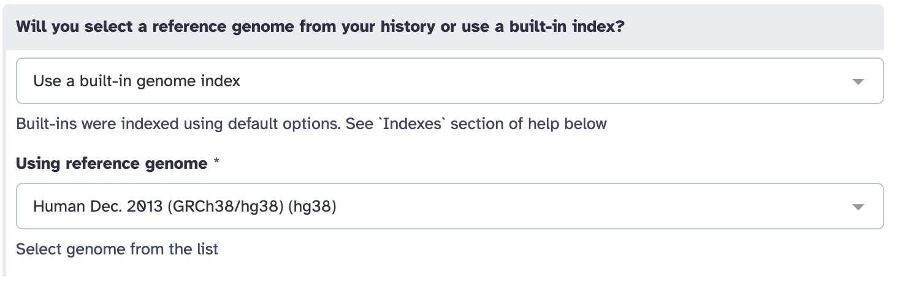
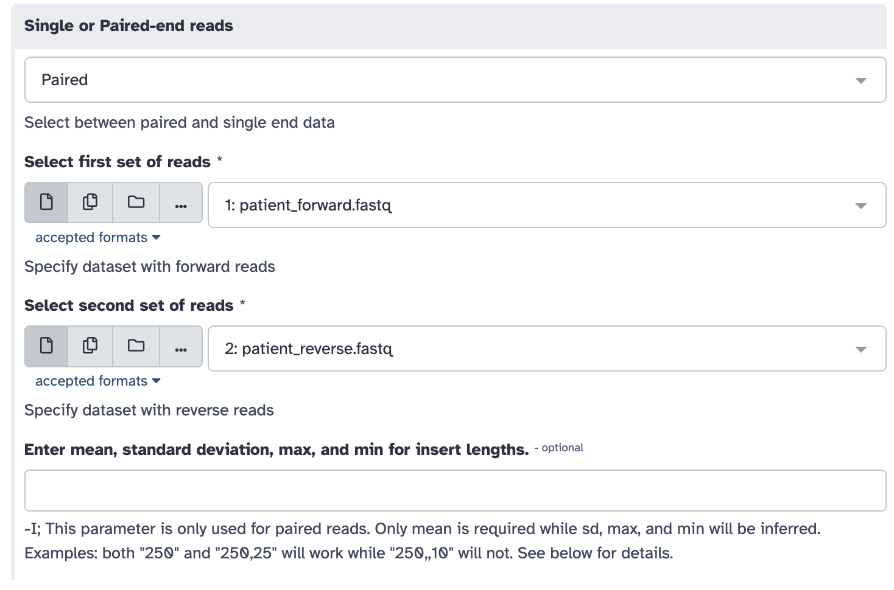

# Czech Hopes Workshop - Task 2 (GALAXY)

## Prihlásenie a načítanie dát

### Časť 1 - prihlásenie sa do Galaxy
1. Vytvorte si účet na https://usegalaxy.eu/
2. Pripojte sa na https://usegalaxy.cz/join-training/czech-hopes-2026

### Časť 2 - načítanie histórie
Histories -> Public histories -> czech hopes 2026 (https://usegalaxy.eu/u/xpolako3/h/czech-hopes-2026) -> Import this history

## TASK

### Mapping
- **Tool** : BWA-MEM2
- **Parametre nastavte nasledovne**
    -  referenčný genóm
       
    - pacientské dáta
    
    - iné nstavenia
    
    - **OSTATNÉ NEMEŇTE!!!**

### Hľadanie mutácie
1. V histórii kliknite na `View (symbol oka)` po tom čo mapping skončí.
2. V genómovom prehliadači chodťe na chromozóm 11 na pozíciu `chr11:5225464-5225726`.
3. Nájdite pozíciu mutácie.
